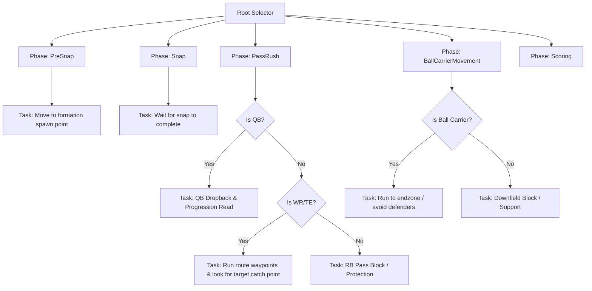

# Offensive AI Behavior Tree & Blackboard Specification

This document details the Behavior Tree (BT) and Blackboard (BB) configuration for offensive skill positions (Quarterback, Running Back, Wide Receiver, and Tight End) in `play-sports`. 

## Blackboard Keys Specification

The following keys must be defined in the Blackboard asset used by the offensive AI Controllers:

| Key Name | Key Type | Description | Updated By |
| --- | --- | --- | --- |
| `PlayPhase` | Int / Enum (`EPlayPhase`) | Current phase of the play (PreSnap, Snap, PassRush, etc.) | `APSOffenseController` (via Telemetry PhaseChange) |
| `Ball` | Object (`APSBall`) | Reference to the active ball actor | `APSOffenseController` (via Telemetry Throw/Fumble) |
| `BallCarrier` | Object (`APSPlayerPawn`) | Reference to the player pawn currently carrying the ball | `APSOffenseController` (via Telemetry Snap/Catch) |
| `bHasPossession` | Bool | Whether the possessed pawn itself is currently carrying the ball | `APSOffenseController` (local calculation on possession change) |
| `TargetLocation` | Vector | World target position for movement | BT Task / Controller |
| `RouteWaypointIndex` | Int | Index of the active waypoint for the player's route | BT Route Task |
| `IsDefenderNear` | Bool | Whether a defender is within tackling/pressure range | BT Service (Close Defender Check) |

---

## Behavior Tree Logic Layout

The Behavior Tree structure splits behavior based on the current play phase (read from the Blackboard `PlayPhase` key) and the player's role (read from the Pawn's attributes):

### 1. Phase: PreSnap
- **Condition**: `PlayPhase == EPlayPhase::PreSnap`
- **Behavior**: All offensive skill players move to their designated formation starting positions (`APSPlayerPawn::GetStartingLocation()`).
- **Goal**: Form up at the line of scrimmage and orient toward the defense.

### 2. Phase: Snap
- **Condition**: `PlayPhase == EPlayPhase::Snap`
- **Behavior**: Offensive players stand fast, waiting for the ball to be snapped by the Center.
- **Goal**: Prevent offsides infractions.

### 3. Phase: PassRush
- **Condition**: `PlayPhase == EPlayPhase::PassRush`
- **Sub-behaviors**:
  - **Quarterback (QB)**:
    - Performs dropback to a pocket coordinate (e.g., 5-7 yards behind the line of scrimmage).
    - If pressured (`IsDefenderNear == True`), checks for scrambling or throwaway targets.
    - Otherwise, scans eligible receivers downfield.
  - **Receivers (WR/TE)**:
    - Retrieve assigned route waypoints.
    - Move sequentially through waypoints.
    - If the ball is in flight (`Ball` is valid and launched), break route to converge on the target catch point.
  - **Running Back (RB)**:
    - Scans for blitzing defenders to pass-block.
    - If no blitzer threatens the QB, drifts into a flat route as checkdown receiver.

### 4. Phase: BallCarrierMovement
- **Condition**: `PlayPhase == EPlayPhase::BallCarrierMovement`
- **Sub-behaviors**:
  - **Ball Carrier (Pawn has possession)**:
    - Scans the field and moves forward/downfield toward the goal line.
    - Adjusts path to avoid defenders based on proximity.
  - **Supporting Blockers**:
    - Select nearest defender and engage in run-blocking to pave a path for the carrier.

### 5. Phase: Scoring / Play Ends
- **Condition**: `PlayPhase == EPlayPhase::Scoring`
- **Behavior**: Stop all active gameplay locomotion, clear movement paths, and await play reset.
